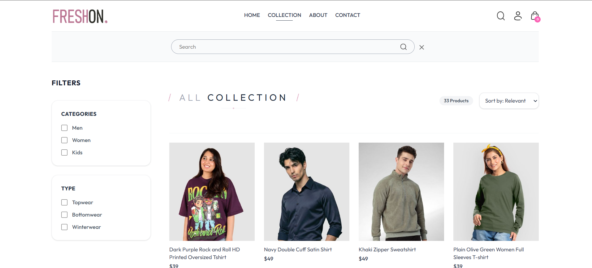

# 🛒 Freshon — Full Stack E-commerce Platform

A full-stack e-commerce application built with a modern MERN architecture, featuring user authentication, product management, cart system, order flow, and optimized backend performance using Redis caching.

---

## 🚀 Features

### 👤 User Side

* User authentication (JWT-based login/signup)
* Browse products with filters and search
* Product detail page with related products
* Add to cart and update cart
* Place orders with payment integration
* View order history
* Stripe & Razorpay payment support

### 🛠️ Admin Panel

* Admin authentication
* Add products with multiple image uploads (Cloudinary)
* View product list
* Manage orders
* Update order status

### ⚡ Backend Optimizations

* Redis caching with:

  - ID-list based caching for product listing
  - Per-product caching
  - Redis pipeline for batch fetching
  - Cursor-based pagination (no duplicates, stable sorting)
  - Rate limiting for API protection
  - Centralized error handling

---

## 🧱 Tech Stack

### Frontend

* React (Vite)
* React Router
* Tailwind CSS
* Axios
* React Toastify

### Backend

* Node.js
* Express.js
* MongoDB (Mongoose)
* Redis (ioredis)
* JWT Authentication
* Multer (file uploads)
* Cloudinary (image storage)

### Payments

* Stripe
* Razorpay

---

## 📁 Project Structure

```
freshon/
│
├── admin/         # Admin dashboard (React + Vite)
├── frontend/      # User frontend (React + Vite)
├── backend/
│   ├── config/
│   ├── controllers/
│   ├── middleware/
│   ├── models/
│   ├── routes/
│   ├── utils/
│   └── server.js
```

---

## 📄 Key Pages

### Frontend

* Home
* Collection (Product listing with filters)
* Product Detail
* Cart
* Orders
* Login/Register
* Place Order
* Contact / About

### Admin

* Login
* Add Product
* Product List
* Orders Management

---

## ⚙️ Environment Variables

Create a `.env` file in the backend:

```
PORT=4000
MONGODB_URI=your_mongodb_uri
JWT_SECRET=your_secret

CLOUDINARY_NAME=your_cloud_name
CLOUDINARY_API_KEY=your_key
CLOUDINARY_SECRET_KEY=your_secret

STRIPE_SECRET_KEY=your_key
RAZORPAY_KEY_ID=your_id
RAZORPAY_KEY_SECRET=your_secret

REDIS_URL=your_redis_url
```

Create a `.env` file in the frontend:

```
VITE_API_BASE_URL=your_backend_url
VITE_STRIPE_PUBLIC_KEY=your_public_key
```


---

## 🧪 Run Locally

### Backend

```
cd backend
npm install
npm run server
```

### Frontend

```
cd frontend
npm install
npm run dev
```

### Admin Panel

```
cd admin
npm install
npm run dev
```

---

## ⚡ Performance Highlight

* Reduced product listing response time using Redis caching
* Implemented pipeline-based batch fetching to minimize network overhead
* Optimized pagination using cursor-based approach instead of skip/limit

---

## 🌐 Deployment

Frontend: https://freshon.siddhant36.in
Admin:  https://freshon.admin.siddhant36.in
Backend: https://freshion.vercel.app

---

## 🔐 Security Note

Admin credentials are not exposed publicly to prevent unauthorized access and data manipulation.

---

## 📌 Notes

* Uses cursor-based pagination instead of offset pagination for scalability
* Redis caching is implemented at both list and entity level
* Designed to handle growing product datasets efficiently

---

## 📷 Screenshots

### 🛍️ Product Collection Page
Product listing with filtering, sorting, and cursor-based pagination. Backend optimized using Redis caching and pipeline batching.

<p align="center">
  
</p>

---

### 🔐 Admin Panel Login
Secure admin authentication with role-based access control. Only authorized users can access product and order management features.

<p align="center">
  
</p>

---


## 🧠 Challenges & Learnings

- Implemented cursor-based pagination to avoid duplication issues in dynamic datasets
- Designed Redis caching strategy using ID-list + per-entity caching
- Used Redis pipeline to reduce multiple network round trips
- Handled authentication securely using JWT and standardized Bearer tokens
- Managed CORS and cross-origin issues across multiple deployed domains

## 📬 Contact

For queries or collaboration, feel free to connect or raise an issue in this repository.